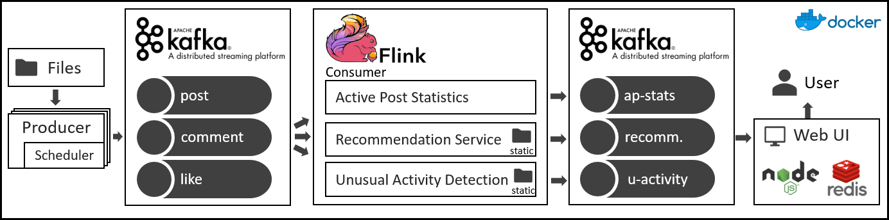

# Data Stream Processing and Analytics: Semester Project

## Description
### Problem Statement:
The project uses the stream processing tools Kafka and Flink to build the backend of a hypothetical social network.
A brief overview of the four parts of the project is given below and more details can be found in the `/reports` folder.

#### Data Preparation
This part of the project is about building a realistic simulation source of the social network streams with typical characteristics such as out-of-order events or a speedup factor.

#### Active Posts Statistics
This task continuously aggregates the overall level of activity per active post using fundamental streaming operators for grouping, counting and windowing.

#### Recommendations
This task analyses the behaviour of the users of the social network and provides friends recommendations based on similarities between the users.

####  Unusual Activity Detection
This task constantly analyses the behaviour of the users of the social network and detects unusual activities of users which could indicate that an account is a bot.

### Architecture

TODO: reformulate

The producer reads the provided social network streaming files and writes them to Kafka.
These Kafka topics are separately consumed and processed in a Flink application.
The outputs of the three tasks are written to Kafka.
A small Web UI is provided which helps visualizing the results.
For convenience we provide everything within a Dockerized environment but the different parts could also be run in a cluster.
More details about the architecture can be found in the reports. (see `/reports`)

### Configuration of Analytics Task
The three analytics task can be configured using the properties file:
`social-network-analysis/src/main/java/ch/ethz/infk/dspa/config.properties`

We suggest to use the default configuration because these parameters were tuned to produce reasonable results.

## Instructions

### Overview

1. [ ] Download / Install Dependencies
    1. [ ] Docker
    2. [ ] Python 3 with `tqdm`
    3. [ ] link Binary
2. [ ] Data Preparation
    1. [ ] Download Data
    2. [ ] Clean Event Streams `python scripts/stream_cleaning.py`
    3. [ ] On Windows adjust file endings from files: `scripts/file_endings_win.bat`
3. [ ] Run Application `scripts/_start.sh`

### Limitations and Performance

To run the entire application stack including all three analytics tasks and data producers at the same time, a machine with at least 16GB of RAM is necessary. This is caused by the wide range of tasks that need to run simultaneously. Additionally, it is preferable to have at least a quad-core processor, as the architecture might not perform at its best otherwise.

### Dependencies

The following dependencies are needed to prepare for and run the streaming application:

- Docker (latest, at least ~18.04)
  - Get it from the [Official Website](https://www.docker.com/get-started)
- Python 3
  - Install the `tqdm` Python package (`pip install tqdm`)
- Flink Binary in `.tgz` format
  - Download the Flink 1.8.0 dependency to use from the official mirror and store it in the project root
  - Available on https://archive.apache.org/dist/flink/flink-1.8.0/flink-1.8.0-bin-scala_2.11.tgz
  - This will be bundled into the docker images, so naming is important

### Data Preparation

The data files that are to be fed into the streaming application need to be prepared as follows:

- Add data files into the `data/` folder
  - Unpacked into subfolders called `1k-users-sorted` and `10k-users-sorted`
- Run the cleanup script with Python (`python scripts/stream_cleaning.py`)
  - This will clean the data files and eliminate cases in which the logical ordering of events is violated.
    (Comment arrives before Post, Like arrives before Post and Reply arrives before Comment)

The data can be found here:
- Small (1K people): https://polybox.ethz.ch/index.php/s/qRlRpFhoPtdO6bR   
- Medium (10K people): https://polybox.ethz.ch/index.php/s/8JRHOc3fICXtqzN

### Running the Streaming Application

Once the dependencies have been installed and the data is in the correct location/format, run the application as follows:

- Run `scripts/_start.sh`, which does the following in its default configuration (see below for parametrization):
  - Bootstraps an entire Kafka/Flink infrastructure
  - Starts Flink job clusters for the three streaming analytics tasks
  - Once everything is ready, runs three stream producers for the cleaned input topics (post/comment/like)
  - Starts up the custom web interface that visualizes the analytics outputs (frontend/backend/cache)

After the application has been successfully bootstrapped, the following services are available:

- Flink WebUIs for all three tasks
  - Task 1 - Active Post Statistics at `localhost:8081`
  - Task 2 - Recommendations at `localhost:8082`
  - Task 3 - Unusual Activities at `localhost:8083`
- The custom visualization frontend at `localhost:4000`
- Optionally, the Kafka Topics UI can be started at `localhost:8080`
  - Use `scripts/_start.sh --kafka-ui`
  - Can be used to investigate contents of all topics in Kafka
  - Needs to be configured to read from the `kafka:9092` cluster
  - The available topics are:
    - Input topics: `[post, comment, like]`
    - Output topics: `[active-posts-out, recommendations-out, anomalies-out]`

### Parametrization

The streaming application can be parametrized by several means:

- Command line arguments to `scripts/_start.sh`
  - To run the Kafka Topics UI on port 8080:
    - `scripts/_start.sh --kafka-ui`
  - To run a specific analytics task instead of all three at once:
    - `scripts/_start.sh --task statistics`
    - `scripts/_start.sh --task recommendations`
    - `scripts/_start.sh --task anomalies`
    - Defaults to running all tasks simultaneously
  - To increase the parallelism of the analytics tasks:
    - `scripts/_start.sh --parallelism X` where X > 0
    TODO [rsc] is this still default
    - Defaults to parallelism=1 for performance reasons
  - To change the directory where data is to be read from:
    - `scripts/_start.sh --source-dir=X --data-dir=Y`
      - X must point to the root of the code repository
      - Y must specify the folder name containing streams and tables
      - X defaults to `./`, Y defaults to `10k-users-sorted`
    - The data needs to have been cleaned with the Python scripts!
  - To change the bounded random amount of time which causes the events to be served slightly out-of-order of their timestamps:
    - `scripts/_start.sh --maxdelaysec X` where X >= 0
    - Defaults to 600 seconds
  - To change the speedup factor parameter that adjusts serving speed:
    - `scripts/_start.sh --speedup X` where X > 0
    - Defaults to a factor of 1200
    - 1 hour / 1200 = 3.0 seconds, meaning all events of a given hour are served in 3 seconds

### Troubleshooting

- To connect to Kafka from the host machine, use `localhost:29092`.
  - `kafka:9092` is only available inside Docker containers.
- If there have been any code changes at all, make sure to run `_start.sh` with the `--build` parameter. This ensures that all the changes code is also actually bundled into the docker images before running them.
- On Windows, there might be issues with files not being found inside most of the Docker containers
  - Most often, this occurs to the data and other files being stored with Windows file-endings, which breaks when reading them in Linux
  - To convert these files to use the appropriate Linux file-endings, run `scripts/file_endings_win.bat` from the repository root

## Authors
- Roland Schlaefli, 12-932-398
- Nicolas Kuechler, 14-712-129
