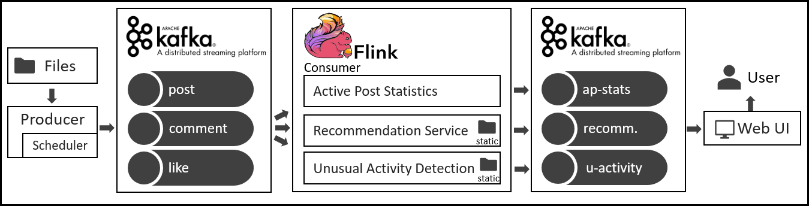

# DSPA 2019 - Design Document

Roland Schlaefli, 12-932-398 and Nicolas Kuechler, 14-712-129

The processing engine of choice for the streaming application is Apache Flink. The main drivers behind this choice were the maturity and popularity (especially in the industry) of the Java ecosystem and Apache Flink itself.

Apart from Flink, Apache Kafka is used as an auxiliary system for both input and output streams. Results are visualized in a web UI with a foundation on existing open-source solutions for consumption of Kafka topics. While the current design implementation does not include any state backend or external key-value storage system, this might change in future iterations, where e.g. RocksDB could be a useful addition.

The figure below provides an overview of the overall architecture of the system:

## Input Pipeline

The input pipeline consists of three custom Kafka producers that simulate realistic streaming sources. The streams are read from files and written to separate Kafka topics (`post`, `comment`, and `like`). Each event is scheduled such that it is produced proportional to the event time plus a bounded random delay. A speedup parameter can be used to control the speed of the stream. Data transmitted through Kafka is encoded and decoded using Avro schemas, simplifying data ingestion by the Flink consumer.

Using Kafka increases the latency of the system but brings the advantage of failure handling and replay capabilities, overall leading to a more reliable system considering the application context. Due to the reliance on event time for processing, the introduction of a bounded random delay can lead to events that arrive out of order. To guarantee correct semantics for time-sensitive operators, periodic watermarks are generated at the source of the consumer based on the same upper bound of random delay as is set in the producer. This necessarily increases the latency but is inevitable for correct results.

## Task 1 - Active Posts Statistics

The basic approach of the post statistics computation is to first map comments to a post id, such that all streams can be merged into a single stream with a common schema keyed by post id. Based on all three input streams, all information except a triple consisting of post id, type (post, reply, comment, or like), and a person id along with the event time, can be directly discarded. No additional information or static data is required to compute the results.

Based on the prepared input stream, events are assigned to sliding windows of 12-hour length and 30-minute step size. Incremental aggregation functions with an internal state can then be applied to the windows to compute comment, reply, and unique people counts. To achieve unique people counts, an internal set of known person ids will need to be maintained in addition to the mapping of post id to count. If active post statistics are kept for the entire time a post is active, a global state stores the necessary data that is no longer in the current window.

## Task 2 - Recommendations

The high-level idea of the friends' recommendation computation is to generate a vector representation of each user (i.e., a user embedding) based on two main components:

- User activity over the last 4 hours (tags of created posts, liked posts or commented posts, tags of the forum a user interacted with, posting/commenting from a place, possibly even topics of the content)
- Static information (work at organization, study at university, interest in tags, interest in tags of the same class, membership in forum, speaking a language)

Given user embeddings and a similarity metric (e.g. Euclidean distance or cosine similarity), the top 5 most similar people can be calculated for every person, filtering out inactive users or already existing friendships. In a first iteration, the user embeddings are purely based on simple counts of interactions with the different categories (tags, tag classes, places, languages, ...). In a second iteration, this idea can possibly be extended to a similarity learning method trying to ensure that people that are actually friends also receive a high similarity.

To achieve its goal, the recommendations task processes all three input streams enriched with static data at certain operators. The required static data can be loaded into memory from the respective file in the open() function of rich operators.

## Task 3 - Unusual Activity Detection

Similar to the recommendations task, the unusual activity detection computations are also based on all three streams, enriched by static data. The main concept of the pipeline consists of several steps. In the first step, predefined features are extracted from the input streams. For all of these features, the deviation from the mean (e.g., by x standard deviations) can be used to detect unusual activity. The final decision on flagging an event is taken according to the majority vote among the ensemble of features.

Possible features that could be included in the ensemble computation include (partially inspired by [Forbes](https://www.forbes.com/sites/forbesagencycouncil/2018/08/06/bot-or-not-seven-ways-to-detect-an-online-bot/)):

- Timespan between events of a user (e.g., likes)
- Contents of posts or comments of a user (e.g., unique words)
- Ratio of interactions of a post or user (e.g., many likes, few comments)
- Number of interacting users with newly created accounts (e.g. friends, likers)
- Number of tags assigned to a post
- Number of previous non-fraudulent activities
- Duration of activeness of a post (e.g., if posts are active over an exceptionally long time)

These two types of events are finally split into two output streams: one stream contains usual activity, while another stream contains all the events that are deemed unusual. Further analyzing the stream of unusual events with a window-based approach and flagging all users that accumulate too many suspicious events within a given time-frame allows for a reasonable distinction of one-time outliers from unusual activity.

## Output Pipeline

The results of the streaming analytics tasks are all written to separate Kafka topics (i.e., ap-statistic, recommendation, and unusual-activity). Since Kafka is already used for the input pipeline, there is little overhead to writing to it in the output pipeline. Alongside the other advantages of Kafka, this also introduces decoupling between the processing layer and the web UI visualization layer.
