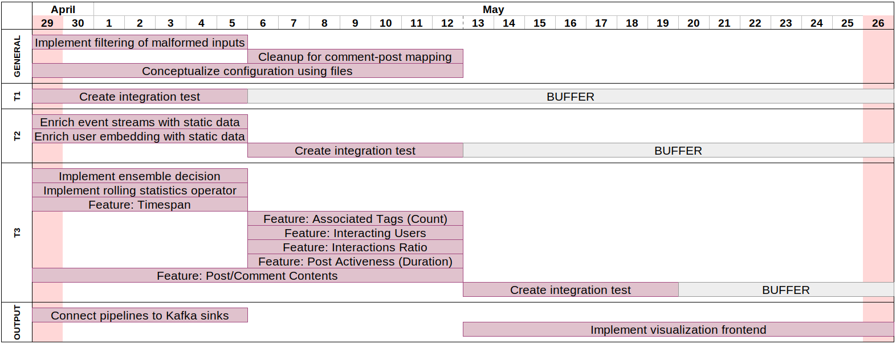

# DSPA 2019 - Midterm Report

Roland Schlaefli, 12-932-398 and Nicolas Kuechler, 14-712-129

## Challenges & Issues

The main challenges so far were mostly related to documentation and examples for common but non-trivial patterns. While the book and the documentation are great for an introduction to the most important basic building blocks of Flink, we missed a collection of design patterns and best practices for more complex pipelines. Additionally, we found that the transparent handling of watermarks/timestamps without a detailed description of their effects makes it more difficult to develop certain functionality.

To overcome these issues, we decided to develop a unit or integration test for each non-trivial user-defined function depending on whether the function depends on state. This approach allows us to develop each function in isolation and easily verify and understand its behavior. Furthermore, it has often proven helpful to examine the intricacies of operators through debugging.

## Current Progress

To plan and coordinate the project, we divided each task into granular subtasks represented as GitLab issues. In a first step of each task, we built a code skeleton consisting of the topology of the dataflow graph without implementing any logic for the individual user-defined functions. Detailed descriptions including estimations of progress are provided in the following subsections.

### Data Preparation (#0)

> Estimated progress: 95%

The three event streams are produced to separate Kafka topics from which they can be consumed by the analytics tasks. All of the required features (e.g., bounded out-of-orderness) are implemented. The only remaining issue is filtering the malformed input data.

### Active Posts Statistic (#1)

> Estimated progress: 95%

Almost all issues for the active post statistics task are completed.
This includes the overall dataflow with the active post windowing logic, the commentId-postId mapping, the comment/reply count, and the unique interacting people count. The outline for a full integration test has been created.

### Recommendations (#2)

> Estimated progress: 80%

The pipeline for the recommendation of new friends is largely implemented. This includes mapping and aggregating events into user embeddings, selecting 10 users for recommendations, calculating similarities between user embeddings, filtering existing friends, and selecting the top-5 most similar users. Computations are based on the activity of the last 4 hours and updated every hour. A full integration test has been implemented as a skeleton.

### Unusual Activity Detection (#3)

> Estimated progress: 20%

The skeleton for the unusual activity detection pipeline is implemented and composed of an extensible set of independent features that are combined in an ensemble approach to decide if a user is suspicious.
The work on two of these features (timespan between user interactions and post/comment content) has already started. Additionally, a first integration test skeleton is ready for future extensions.

## Remaining Work

The remaining issues for the final milestone are depicted in the timeline for completion. For each analytics task, a time buffer is included in case the complete integration test reveals additional issues.

## Divergences from Original Plan

TODO: sketch for kafka postid mapping?

Contrary to our initially ideated approach of not having intermediate results in external systems, our new solution outputs commentId-postId mappings to a Kafka topic. The pipelines then consume this topic to enrich replies with the corresponding postId. This choice increases latency in case a group of dependent comments arrive almost concurrently but brings the advantage of avoiding broadcasting and buffering each comment to every node to build up the complete comment tree. In a realistic scenario in which most dependent comments arrive with a delay greater than the latency of writing and reading from Kafka, there is no additional latency.
